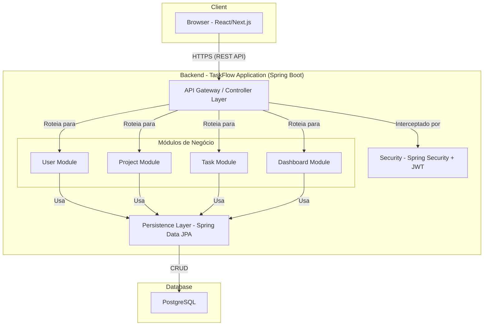

# Arquitetura Técnica - TaskFlow

## 1. Visão Geral

Este documento descreve a arquitetura técnica para a aplicação TaskFlow, baseada na stack **Java 17+**, **Spring Boot 3+** e **PostgreSQL 15+**.

A abordagem arquitetural escolhida para o MVP é um **Monólito Modular**. Esta abordagem nos permite desenvolver e implantar a aplicação como uma única unidade, mas com uma separação lógica clara entre os domínios de negócio. Isso simplifica o desenvolvimento inicial e a infraestrutura, ao mesmo tempo que pavimenta o caminho para uma futura migração para microserviços, se necessário.

## 2. Estrutura de Módulos (Pacotes)

O projeto será estruturado em pacotes Java que representam os principais domínios da aplicação:

-   `com.taskflow.taskflow`
    -   `core`: Contém classes base, configurações globais, exceções customizadas e utilitários compartilhados.
    -   `config`: Configurações de segurança (Spring Security, JWT), CORS e outras configurações de infraestrutura.
    -   `user`: Responsável pela gestão de usuários, perfis, autenticação e autorização.
        -   `controller`: Endpoints para registro, login, gerenciamento de usuários.
        -   `service`: Lógica de negócio relacionada a usuários.
        -   `repository`: Interfaces do Spring Data JPA para a entidade `User`.
        -   `dto`: Data Transfer Objects para a API de usuário.
        -   `model`: Entidade JPA `User`.
    -   `project`: Responsável pela gestão de projetos e membros.
        -   `controller`, `service`, `repository`, `dto`, `model`
    -   `task`: Responsável pela gestão de tarefas, comentários e anexos.
        -   `controller`, `service`, `repository`, `dto`, `model`
    -   `dashboard`: Responsável por agregar dados e preparar as informações para os dashboards.
        -   `controller`, `service`

## 3. Esquema do Banco de Dados (PostgreSQL)

Abaixo está o esquema SQL para as tabelas principais.

```sql
-- Enum para os papéis de usuário, garantindo consistência.
CREATE TYPE user_role AS ENUM ('ADMIN', 'MANAGER', 'COLLABORATOR');

-- Tabela de Usuários
CREATE TABLE users (
    id UUID PRIMARY KEY DEFAULT gen_random_uuid(),
    name VARCHAR(255) NOT NULL,
    email VARCHAR(255) UNIQUE NOT NULL,
    password_hash VARCHAR(255) NOT NULL,
    role user_role NOT NULL,
    created_at TIMESTAMP WITH TIME ZONE DEFAULT now()
);

-- Tabela de Projetos
CREATE TABLE projects (
    id UUID PRIMARY KEY DEFAULT gen_random_uuid(),
    name VARCHAR(255) NOT NULL,
    description TEXT,
    owner_id UUID NOT NULL REFERENCES users(id),
    created_at TIMESTAMP WITH TIME ZONE DEFAULT now(),
    archived BOOLEAN DEFAULT false
);

-- Tabela de Associação (Muitos-para-Muitos entre Usuários e Projetos)
CREATE TABLE project_members (
    project_id UUID NOT NULL REFERENCES projects(id) ON DELETE CASCADE,
    user_id UUID NOT NULL REFERENCES users(id) ON DELETE CASCADE,
    PRIMARY KEY (project_id, user_id)
);

-- Enum para o status da tarefa
CREATE TYPE task_status AS ENUM ('TODO', 'IN_PROGRESS', 'DONE');

-- Tabela de Tarefas
CREATE TABLE tasks (
    id UUID PRIMARY KEY DEFAULT gen_random_uuid(),
    title VARCHAR(255) NOT NULL,
    description TEXT,
    status task_status NOT NULL DEFAULT 'TODO',
    due_date DATE,
    project_id UUID NOT NULL REFERENCES projects(id) ON DELETE CASCADE,
    assignee_id UUID REFERENCES users(id), -- Pode ser nulo se não atribuído
    created_at TIMESTAMP WITH TIME ZONE DEFAULT now()
);

-- Tabela de Comentários
CREATE TABLE comments (
    id UUID PRIMARY KEY DEFAULT gen_random_uuid(),
    content TEXT NOT NULL,
    task_id UUID NOT NULL REFERENCES tasks(id) ON DELETE CASCADE,
    user_id UUID NOT NULL REFERENCES users(id),
    created_at TIMESTAMP WITH TIME ZONE DEFAULT now()
);

-- (Opcional) Tabela de Anexos - Simplificada
CREATE TABLE attachments (
    id UUID PRIMARY KEY DEFAULT gen_random_uuid(),
    file_name VARCHAR(255) NOT NULL,
    file_url VARCHAR(255) NOT NULL, -- URL para um S3 ou similar
    task_id UUID NOT NULL REFERENCES tasks(id) ON DELETE CASCADE,
    uploaded_by_id UUID NOT NULL REFERENCES users(id),
    created_at TIMESTAMP WITH TIME ZONE DEFAULT now()
);
```

## 4. Padrões de API

### API RESTful
A comunicação entre o frontend e o backend será feita através de uma API RESTful. Os endpoints seguirão os padrões de recursos (ex: `/api/projects`, `/api/projects/{projectId}/tasks`).

### Autenticação (JWT - JSON Web Tokens)
O fluxo de autenticação será baseado em JWT:
1.  O cliente envia `email` e `senha` para o endpoint `POST /api/user/login`.
2.  O servidor valida as credenciais. Se válidas, gera um JWT contendo `userId`, `email` e `role`.
3.  O token é retornado ao cliente, que o armazena (em memória ou `localStorage`).
4.  Para cada requisição subsequente a endpoints protegidos, o cliente envia o token no cabeçalho `Authorization` (ex: `Authorization: Bearer <token>`).
5.  Um filtro do Spring Security intercepta a requisição, valida o token e estabelece o contexto de segurança.

### DTOs (Data Transfer Objects)
Usaremos DTOs para desacoplar a camada da API da camada de persistência (entidades JPA).

**Exemplo de DTO para criação de tarefa:**
```java
// Request Body para POST /api/projects/{projectId}/tasks
public record CreateTaskDTO(
    @NotBlank String title,
    String description,
    @NotNull UUID assigneeId,
    @FutureOrPresent LocalDate dueDate
) {}
```

**Exemplo de DTO de resposta para uma tarefa:**
```java
public record TaskDTO(
    UUID id,
    String title,
    String description,
    String status,
    LocalDate dueDate,
    UserSummaryDTO assignee
) {}
```

## 5. Diagrama de Componentes

Abaixo, um diagrama em Mermaid JS que ilustra a arquitetura.


